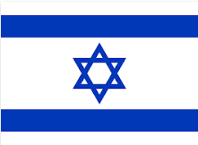

# `Hebrew_Junior_01`
希伯來文新手入門 - 01

---
- [第 1 章　22個字母](docs/CH01.md)
 - ３個母音字母 ה ו י
 - ４個喉音字母 א ע ה ח  （另一字母 ר 也有喉音表現）
 - ５個字母有字尾形式 (sofit) ץ/צ ,ף/פ ,ן/נ ,ם/מ ,ך/כ
 - ６個 Begadkephat 字母 ב ג ד כ פ ת
- [第 2 章　字母探討](docs/CH02.md)

- [第 3 章　母音符號 (一)](docs/CH03.md)

- [第 4 章　母音符號 (二)](docs/CH04.md)
 
- [第 5 章　音節化](docs/CH05.md)
 
- [第 6 章　文字輸入](docs/CH06.md)
 
- [第 7 章　字型資源](docs/CH07.md)
 
---
- [附錄一：網路資源](docs/AP01.md)

- [附錄二：本書URL彙整](docs/AP02.md)

5/13/2015 3:13:29 PM 
