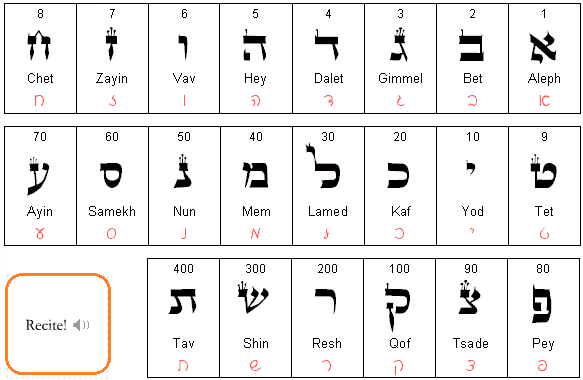
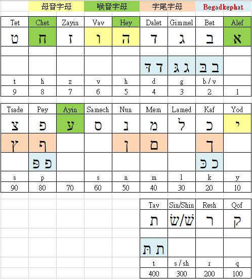

# 第 1 章 22個字母 

#### 閒話家常

曾經因為閱讀聖經中的詩篇119章，才知道**詩篇**這卷書卷是藉由22個希伯來文字母，並且依照其字母順序，以每個字母８小節的架構方式撰寫而成。

    所以，詩篇119章就有 22 * 8 = 176 小節。

對於希伯來文的22個字母，是長得什麼模樣？這份好奇心，就此深藏心中。

近來，有幸在**FB社群** **[學習希伯來語-奇布茲][]**看到一群同好也在學習這種語言，因此就跟著一頭栽下，正式踏入學習希伯來文之路。

杜撰本書的起因，源自於筆者是個希伯來文的初學新生，加上個人自學沒上語言補習班；在經歷學習過程的瓶頸與難處後，才想要將這些歷程的點點滴滴記錄下，以饗日後新進的初學者，免去一些學習上的障礙與迷茫！

#### 本章學習重點：  

	★ 希伯來文書寫習慣，是由右至左。
	★ 希伯來文有22個字母。
	★ 22個字母中，有３個**母音字母**
	★ 22個字母中，有４個**喉音字母**
	★ 22個字母中，有５個字母具有***字尾形式 (sofit)***
	★ 22個字母中，有６個字母，具有兩種發音方式：『塞音』、『擦音』。這類字母稱為 **Begadkephat**。  
	★ 要記得 ３、４、５、６的特色是什麼？

---

## 1.1　22個字母

- 希伯來文書寫習慣，是由右至左。

- 希伯來文共計22個字母，主要是作為**子音**使用。

 	

- 每個字母有其各自的**讀音**。

 	

	★ 可參考[Hebrew4Christians][h4c_字母讀音]網站，點選*Recite! 喇叭*圖案唷。	

 	

- 每個字母各有其**發音**，可以[International Phonetic Alphabet(IPA)][IPA]規則來表示其譯音。

- 每個字母各代表一個**數字值**。例如 Aleph א 代表數字 1。

	因著有這樣的關係，所以將22個字母，分解成 9, 9, 4 來排列，好方便學習、記憶。

 	

- 每個字母的書寫筆順，如下圖所示。

 	

> PS：
	★ 希伯來文的登打，可以用手機、電腦喔！

## 1.2　３個母音字母 ה ו י

- 有３個特定的子音 (ו י ה) ，在**母音符號系統**未被建立起來使用之前，以色列人會將它們拿來當母音來發音，這３個子音就稱為**母音字母**。

 	

- ３個母音字母 ה ו י
 - 子音ה 一般被用來指派成母音 a 用。
 - 子音י 一般被用來指派成母音 e, i 用。
 - 子音ו 一般被用來指派成母音 o, u 用。
 
> PS：
有關母音方面的介紹，請參考第三、四章

## 1.3　４個喉音字母 א ה ח ע 

- 喉音字母：由咽喉發聲的字母

 	

- 字母 ר 不屬於喉音，只是它有些性質與喉音字母一樣，有時會相提並論。

- ４個喉音字母
 - א
 - ה
 - ח
 - ע

## 1.4　５個字母有字尾形式 (sofit) ץ/צ ,ף/פ ,ן/נ ,ם/מ ,ך/כ

- 有５個字母有字尾形式的特性，當這些字母剛好是位於單字的字尾時，就要使用字尾形式(final form)來表示。
	例如：道路 דרך，世界 ארץ 。

 	

- 每個字尾字母有其對應的**名稱說法**。
 - כ 的字尾 ך ，叫做 **kaf sofit**，或是 **final kaf**。
 - מ 的字尾 ם ，叫做 **mem sofit**，或是 **final mem**。
 - נ 的字尾 ן ，叫做 **nun sofit**，或是 **final nun**。
 - פ 的字尾 ף ，叫做 **pey sofit**，或是 **final pey**。
 - צ 的字尾 ץ ，叫做 **tsade sofit**，或是 **final tsade**。

## 1.5　有６個Begadkephat字母 ב ג ד כ פ ת
 
希伯來文字母中，有６個字母具有兩種發音方式。這6個字母稱為 Begadkephat。
它們會以字母有沒有含**點符號**來表示

- 含點符號的字母，以『塞音』來發音。（如英文的 b, p）
- 不含點符號的字母，以『擦音』來發音。（如英文的 v, f）

 	

> PS : 
依據[學習希伯來語-奇布茲]的 [Terence Ha][] 對 Begadkephat 的說明，可以更清楚明白 Begadkephat 的意義。

> Begadkephat，實際上是借用了 
bet 的 b，gimmel 的 g，dalet 的 d，
kaf 的 k，pey 的 ph 和 tav 的 t，
加上韻母(母音)後，b-g-d 變成 begad，k-ph-t 變成 kephat。

## 1.6　總結

作者在個人部落格[Blog][]中，常有分享希伯來文學習心得文章，讀者可多加以閱覽。

- 字母彙整表

 	

- 網路資源
 - [學習希伯來語-奇布茲][]社群 [Kara Lu][] 老師之[希伯來文-字母 & 發音][]
 - [希伯來文字母入門HAME][]：HebrewPod101.com - Hebrew Alphabet Made Easy
 - [希伯來文字母表讀音][]：由[學習希伯來語-奇布茲][]社群[Luke Leung][]弟兄提供
 - [萬門大學·聖經希伯來語][]
 - [Teaching Myself HEBREW][]
 - [Hebrew Alphabet][]
 - [BL211-希伯來文 Hebrew 1][]

- 混淆穹蒼

	剛開始學習希伯來文時，最讓筆者混淆不清的事，就是22個字母的**英文讀音**。來自網站、圖書或是社群的各種資料多多少少都會有些差異。對此，建議讀者要先了解有這個現象，但也不要限在此中（筆者因學理工錙銖必較，致使曾限在此一段時間。），只要稍加參考就好，不用太花時間在此。

	[字母差異][]

	2015年3月1日，柴靜發表的中國霧霾調查紀錄片[**蒼穹之下**](https://www.youtube.com/watch?v=BgEpruEOrFg)，優酷網路上一天的點擊次數超過599萬次，表面來說它是在談 PM2.5，但它也引申出很多、不同面向的議題可以討論。希望讀者在辛苦學習希伯來文的過程中，有時也能放慢點腳步，看清楚你所面對的網路資訊或是你學習的真正目標是什麼？是要讀舊約原文？還是想學現代希伯來文？不要限在一片迷霧中！！

回到[目錄清單](../README.md)頁，選讀其他章節！

---
[Blog]: http://pertonchang.blogspot.tw/
[pertonchang]: http://pertonchang.blogspot.tw/
[目錄清單]: ../README.md

[學習希伯來語-奇布茲]: https://www.facebook.com/groups/308100932705850/
[希伯來文-字母 & 發音]: https://www.youtube.com/playlist?list=PLsNJO0nl_IhQKrgYx2QxJQCeytdf03PNs
[萬門大學·聖經希伯來語]: https://www.youtube.com/playlist?list=PLsNJO0nl_IhR31uQgxYxAV4rS0S5CBoYs
[Teaching Myself HEBREW]: https://www.youtube.com/playlist?list=PLsNJO0nl_IhRQa1a7kKl_58wTSaIcCVXk
[Hebrew Alphabet]: https://www.youtube.com/playlist?list=PLsNJO0nl_IhRC0hoijjHRHZl3IBBviDFu
[BL211-希伯來文 Hebrew 1]: https://www.youtube.com/playlist?list=PLsNJO0nl_IhTS9xn_O5oeY96R_7l6Skdn
[希伯來文字母入門HAME]: http://pertonchang.blogspot.tw/2015/06/blog-post_26.html#links
[希伯來文字母表讀音]: https://www.facebook.com/llukeleung/videos/o.308100932705850/10200750538641520/?type=2&theater

[Terence Ha]: https://www.facebook.com/ha.terence?hc_location=ufi
[Paul Yeh]: https://www.facebook.com/paul.yeh.501?fref=nf
[Kara Lu]: https://www.facebook.com/kara0622
[Luke Leung]: https://www.facebook.com/llukeleung
[hebrew4christians]: http://www.hebrew4christians.com
[h4c_字母讀音]: http://www.hebrew4christians.com/Grammar/Unit_One/Aleph-Bet/aleph-bet.html
[IPA]: http://zh.wikipedia.org/zh-tw/%E5%9C%8B%E9%9A%9B%E9%9F%B3%E6%A8%99

[字母差異]: https://drive.google.com/file/d/0B_l7A1kTqGHmZzRpN1FsNExzazQ/view?usp=sharing
