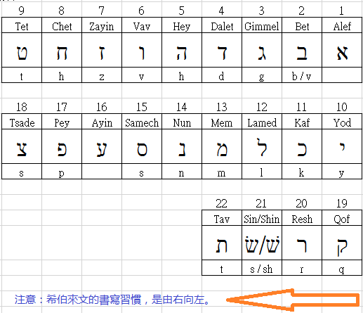
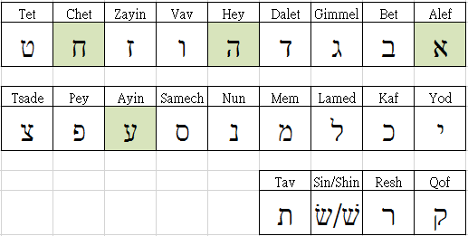
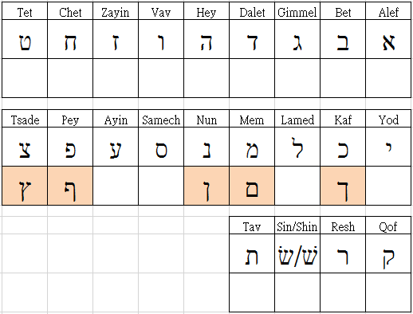

# 第 1 章 22個字母 

曾經因為閱讀聖經中的詩篇119章，才知道**詩篇**這卷書卷是藉由22個希伯來文字母，並且依照其字母順序，以每個字母８小節的架構方式撰寫而成。

    所以，詩篇119章就有 22 * 8 = 176 小節。

對於希伯來文的22個字母，是長得什麼模樣？這份好奇心，就此深藏心中許久。

近來，有幸在**FB**社群**[學習希伯來語-奇布茲][]**看到一群同好在學習這種語言，也就一頭栽下，開始踏入學習希伯來文之路。

因為筆者是個初學者，加上個人自學沒上語言班補習；所以經歷地不少學習上的瓶頸與盲點，才想要將這過程的點點滴滴記錄下，以饗日後新進的初學者。

### 本章學習重點：
- 希伯來文書寫習慣，是由右至左。
- 希伯來文有22個字母。
- 22個字母中，有３個**母音字母**
- 22個字母中，有４個**喉音字母**
- 22個字母中，有５個字母具有***字尾形式 (sofit)***
- 22個字母中，有６個字母，具有兩種發音方式：『塞音』、『擦音』。這類字母稱為 **Begadkephat**。

---------------
## 1.1　22個字母

- 希伯來文書寫習慣，是由右至左。

- 希伯來文共計22個字母，主要是作為**子音**使用。

 	

- 每個字母多有其各自的讀音。[混淆穹蒼](#混淆穹蒼)

 	

- 每個字母多代表一個數字值。例如 Aleph א 代表數字 1。

	因著有這樣的關係，所以將22個字母，分解成 9, 9, 4 來排列，好方便學習、記憶。

 	

> PS :

## 1.2　３個母音字母 ה ו י

- 母音字母

 	

- ３個母音字母 ה ו י
 - ה
 - ו 
 - י

## 1.3　４個喉音字母 א ה ח ע 

- 喉音字母

 	

- 字母 ר 也有喉音表現

- ４個喉音字母
 - א
 - ה
 - ח
 - ע

## 1.4　５個字母有字尾形式 (sofit) ץ/צ ,ף/פ ,ן/נ ,ם/מ ,ך/כ

- 字尾形式

 	

	例如：道路 דרך，世界 ארץ。

## 1.5　有６個Begadkephat字母。
 

希伯來文字母中，有６個字母具有兩種發音方式。這6個字母稱為 Begadkephat。
它們會以字母有沒有含**點符號**來表示

- 含點符號的字母，以『塞音』來發音。（如英文的 b, p）
- 不含點符號的字母，以『擦音』來發音。（如英文的 v, f）

 	

> PS : 依據[學習希伯來語-奇布茲]的 [Terence Ha][] 對 Begadkephat 的說明，可以更清楚明白 Begadkephat 的意義。

> Begadkephat，是借用了 bet 的 b，gimmel 的 g，dalet 的 d，
kaf 的 k，pey 的 ph 和 tav 的 t，
加上韻母(母音)後，b-g-d 變成 begad，k-ph-t 變成 kephat。

Roses are red
Violets are blue

## 1.6　總結

作者在個人部落格[Blog][]中，常有分享希伯來文學習心得文章，讀者可多加以閱覽。

- 字母彙整表

 	

- 混淆穹蒼

<h2 id="dom">混淆穹蒼</h2>

	剛開始學習希伯來文時，最讓筆者混淆不清的事情，就是22個字母的英文讀音。來自網站、圖書或是社群的每種資料多少都會有些差異

柴靜中國霧霾調查：蒼穹之下

回到[目錄清單][]頁，選讀其他章節！

回到[目錄清單](../README.md)頁，選讀其他章節！

[Blog]: http://pertonchang.blogspot.tw/
[pertonchang]: http://pertonchang.blogspot.tw/
[目錄清單]: ../README.md

[學習希伯來語-奇布茲]: https://www.facebook.com/groups/308100932705850/
[001]: https://www.facebook.com/groups/308100932705850/
[002]: https://www.facebook.com/groups/308100932705850/

[Terence Ha]: https://www.facebook.com/ha.terence?hc_location=ufi
[Paul Yeh]: https://www.facebook.com/paul.yeh.501?fref=nf