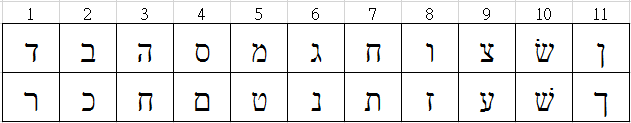
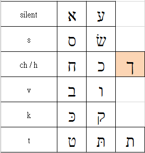
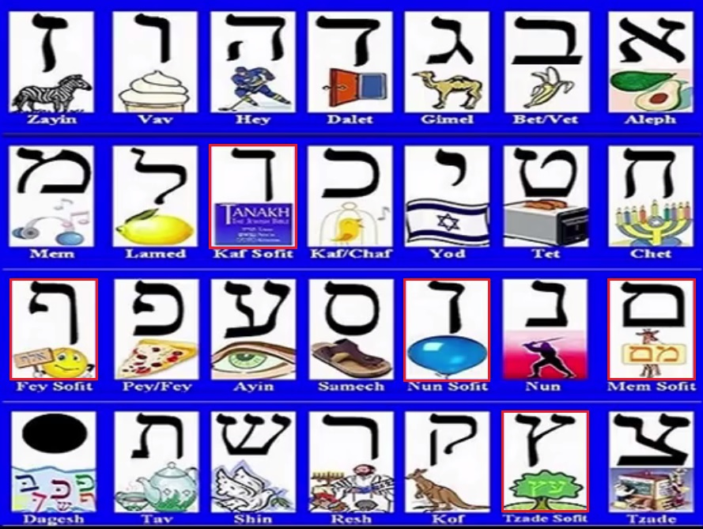

# 第 2 章　字母探討

前一章節已經介紹希伯來文的22個字母。
，沒有母音字母。不過，母音字母還是可以由語言口說的形式來表達出來。

#### 本章學習重點：  

	★ 外觀：容易混淆的字母
	★ 讀音：容易混淆的字母
	★ 書寫字帖
	★ 印刷、書寫、古代、Block字體形狀
	★ 雙子音

---

## 2.1 - 外觀：容易混淆的字母

   

## 2.2 - 讀音：容易混淆的字母

   

## 2.3 - 書寫字帖

哈哈

## 2.4 - 印刷、書寫、古代、Block字體形狀

哈哈
Never Settle 公司的 [Hebrew Flashcards][] App

## 2.5 - 雙子音

哈哈

## 2.6 希伯來語的復活及復興【Revival of Hebrew】 

你有想過為什麼你會想要學希伯來文？
你清楚學習希伯來文的動機？

Revival of Hebrew 希伯來語的復活及復興 （影片中文字幕）
https://www.youtube.com/watch?v=pgjq8uqQ79E

Revival of Hebrew.pdf
[希伯來語的復活及復興][]

## 2.7 更深認識希伯來文

希伯來語沉睡近兩千年，在十九世紀末、二十世紀初之間被喚醒，重新獲得活力，成為廣為引述的語言復振成功的例子。
看看學者**張學謙**的論述專文：[希伯來語復振的經驗][]。

## 2.8 總結
- 字母圖表
   

- 網路資源
 - [AlittleHebrew][]網站，提供[Alef-Beit Chart][]、[Alef-Beit Song][]等資源。 
 - [Learn Hebrew - eTeacherHebrew][]

---
回到[目錄清單][]頁，選讀其他章節！

回到[目錄清單](../README.md)頁，選讀其他章節！

[Blog]: http://pertonchang.blogspot.tw/
[pertonchang]: http://pertonchang.blogspot.tw/
[目錄清單0]: ../README.md

[學習希伯來語-奇布茲]: https://www.facebook.com/groups/308100932705850/
[001]: https://www.facebook.com/groups/308100932705850/
[002]: https://www.facebook.com/groups/308100932705850/

[Terence Ha]: https://www.facebook.com/ha.terence?hc_location=ufi
[Paul Yeh]: https://www.facebook.com/paul.yeh.501?fref=nf
[希伯來語的復活及復興]: https://www.youtube.com/watch?v=pgjq8uqQ79E
[希伯來語復振的經驗]: http://www.tisanet.org/quarterly/7-4-6.pdf
[AlittleHebrew]: http://www.alittlehebrew.com/
[Alef-Beit Chart]: http://www.alittlehebrew.com/sites/default/files/downloads/handouts/alef-beit.pdf
[Alef-Beit Song]: http://www.alittlehebrew.com/sites/default/files/downloads/audio/alef-beit_song.mp3
[Learn Hebrew - eTeacherHebrew]: https://www.youtube.com/playlist?list=PLsNJO0nl_IhQACWH6Ego3Ra-TCvYMJZSY
[Hebrew Flashcards]: https://play.google.com/store/apps/developer?id=Never+Settle&hl=zh_TW