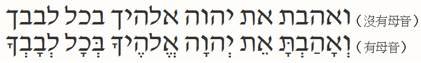
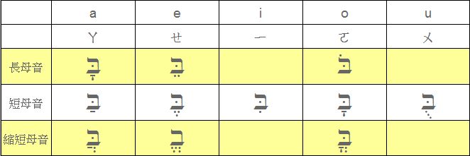
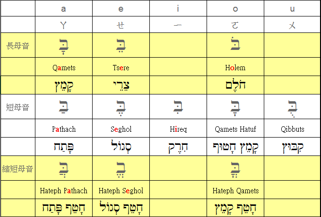
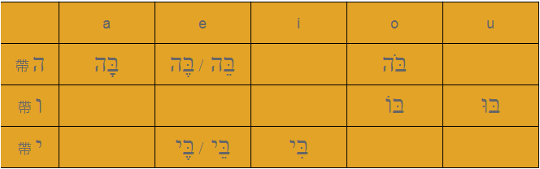
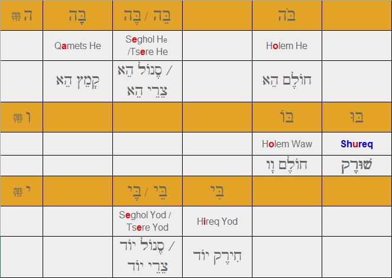

# 第 3 章 母音符號 (一)

希伯來文的書寫系統，原本只有子音字母，沒有母音字母。不過，母音字母還是可以由語言口說的形式來表達出來。  
或許有人會不太了解這是什麼意思？
讓我們用申命記第六章第五節的英文經文，為例子來說明：
Love the Lord your God with all your heart. (你要盡心愛耶和華你的神。)

把經文中的母音去除後，就會變成：
Lv th Lrd yr Gd wth ll yr hrt.
你要將這句話讀出來，就必須依靠你對英文的了解，將必要的母音加以放入正確地位置，才行。

同樣的情形，以前使用希伯來文的人，也會遇到這樣地困惱。
一直到主後第十世紀後半，瑪索拉學者(Masoretes)發展出一套母音標點(pointing)的讀音符號，才將母音的讀音加以保存下來。
由於瑪索拉學者(Masoretes)認為聖經經文是神聖的，所以他們設計出來的母音系統就不會去更改到原有的子音經文。
母音符號是放在子音字母的下面、裡面、左邊或是上面。

我們仍然用申命記第六章第五節的經文來說明 - 希伯來文
	

## 3.1 - 母音符號
- a, e, i, o, u

- 母音可依發音的長、短程度，再分成三類
 - 長母音  
 - 短母音
 - 縮短母音  

  

- 每種母音有其各自的代表符號、英文名稱與希伯來文名稱

	

## 3.2 - 母音字母
我們曾經在第一課提過，22個字母中有３個**母音字母**。

- ３個母音字母 ה ו י
當這３個母音字母與母音符號結合在一起後，又產生出新的發音效果。  
 	

- ３個母音字母也有其各自的代表符號、英文名稱與希伯來文名稱  
 	

 	

---
回到[目錄清單][]頁，選讀其他章節！

回到[目錄清單](../README.md)頁，選讀其他章節！

[Blog]: http://pertonchang.blogspot.tw/
[pertonchang]: http://pertonchang.blogspot.tw/
[目錄清單]: ../README.md

[學習希伯來語-奇布茲]: https://www.facebook.com/groups/308100932705850/
[001]: https://www.facebook.com/groups/308100932705850/
[002]: https://www.facebook.com/groups/308100932705850/

[Terence Ha]: https://www.facebook.com/ha.terence?hc_location=ufi
[Paul Yeh]: https://www.facebook.com/paul.yeh.501?fref=nf